# 📘 ERP Module – Course Registration Platform

This project began as part of our **IC-202P** course, where we were tasked with developing a comprehensive web platform for our college students with features to manage **course pre-registration**, **final registration**, **view results**, **access course information**, and **stay updated with academic events via a calendar**.

Having experienced firsthand the challenges students face with our current systems—shifting from **OAS** to **Samarth**, and at times even relying on **Google Forms**—we recognized the need for a more stable, streamlined, and college-specific solution.

Under the guidance of the **AD (Courses)**, we implemented features tailored to our institute's specific needs. Our team collaborated closely, dividing responsibilities effectively. **My primary focus was on developing the course pre-registration and final registration modules.**

We submitted our initial prototype, which has since been handed over to a dedicated team for further refinement. The enhanced version is planned to be tested for use in the upcoming semester. **This repository is just my contribution to the project.**

---

## ✨ Features

- 📝 Course Pre-Registration and Registration
- 📊 View Course Summaries and Gradecards
- 📅 Event Calendar
- 👨‍🏫 Instructor Interface for Managing Registrations
- 🛠️ Admin Dashboard to Manage Students, Instructors, and Courses

---

## 🚀 Tech Stack

### Frontend:
- **React 19**
- **TypeScript**
- **Vite**
- **Tailwind CSS 4**
- **Shadcn/UI**
- **React Router DOM**

### Backend:
- **Node.js**
- **Express.js**
- **PostgreSQL**

---

## 📁 Project Structure

```
samarth2.0/
├── public/
│   ├── sample_input.txt
│   ├── sample_output.txt
│   └── vite.svg
├── server/
│   ├── database.sql
│   ├── db.js
│   ├── index.js
│   ├── package.json
│   └── package-lock.json
├── src/
│   ├── _auth/
│   │   └── Login.tsx
│   ├── _root/
│   ├── pages/
│   │   ├── AddCourse.tsx
│   │   ├── Admin.tsx
│   │   ├── AllCourses.tsx
│   │   ├── CourseList.tsx
│   │   ├── CourseRegistration.tsx
│   │   ├── CourseSelection.tsx
│   │   ├── EditCourse.tsx
│   │   ├── Home.tsx
│   │   ├── index.ts
│   │   ├── InstructorPage.tsx
│   │   ├── RegisteredCoursePage.tsx
│   │   ├── RegisteredCourses.tsx
│   │   ├── Sidebar.tsx
│   │   ├── Student.tsx
│   │   ├── ThankYou.tsx
│   │   └── RootLayout.tsx
│   ├── assets/
│   ├── components/
│   │   ├── shared/
│   │   │   ├── app-sidebar.tsx
│   │   │   └── Sidebar.tsx
│   │   └── ui/
│   │       ├── alert-dialog.tsx
│   │       ├── aspect-ratio.tsx
│   │       ├── avatar.tsx
│   │       ├── badge.tsx
│   │       ├── button.tsx
│   │       ├── card.tsx
│   │       ├── checkbox.tsx
│   │       ├── popover.tsx
│   │       ├── select.tsx
│   │       ├── separator.tsx
│   │       ├── sidebar.tsx
│   │       ├── skeleton.tsx
│   │       ├── table.tsx
│   │       ├── tabs.tsx
│   │       ├── textarea.tsx
│   │       ├── tooltip.tsx
│   │       └── use-mobile.ts
│   ├── hooks/
│   │   └── use-mobile.ts
│   ├── lib/
│   │   └── utils.ts
│   ├── App.tsx
│   ├── global.css
│   └── main.tsx
├── .gitignore
├── components.json
├── eslint.config.js
├── index.html
├── package.json
├── package-lock.json
├── pnpm-lock.yaml
├── tsconfig.app.json
├── tsconfig.json
├── tsconfig.node.json
└── vite.config.ts
```


---

## ▶️ Try It Out

### 🖥️ Start Backend

```bash
cd server
nodemon index
npm install
npm run dev
```


---


## 📸 Screenshots

### 🏠 Homepage


### 🙋‍♂️ Student Login
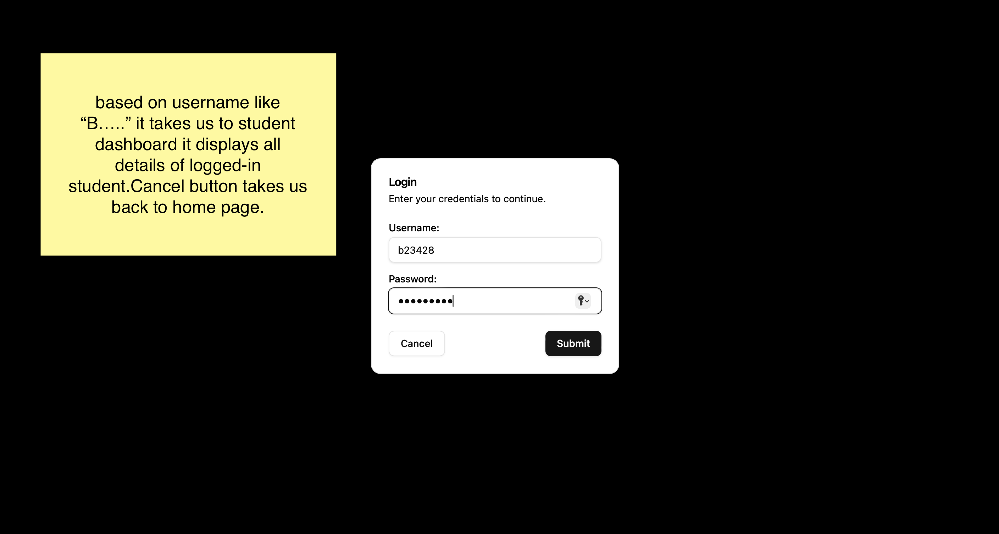

### 📚 Student Dashboard
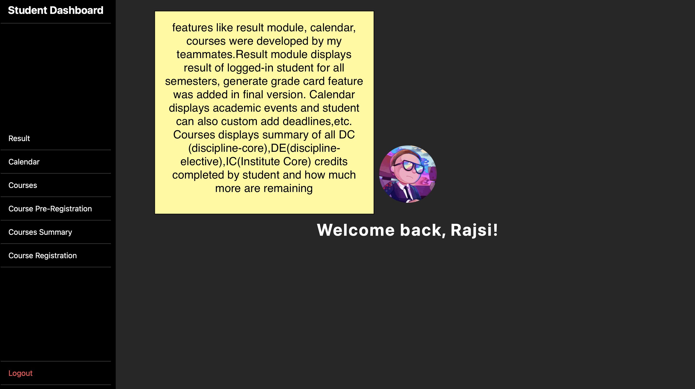

### 📝 Course Pre-Registration
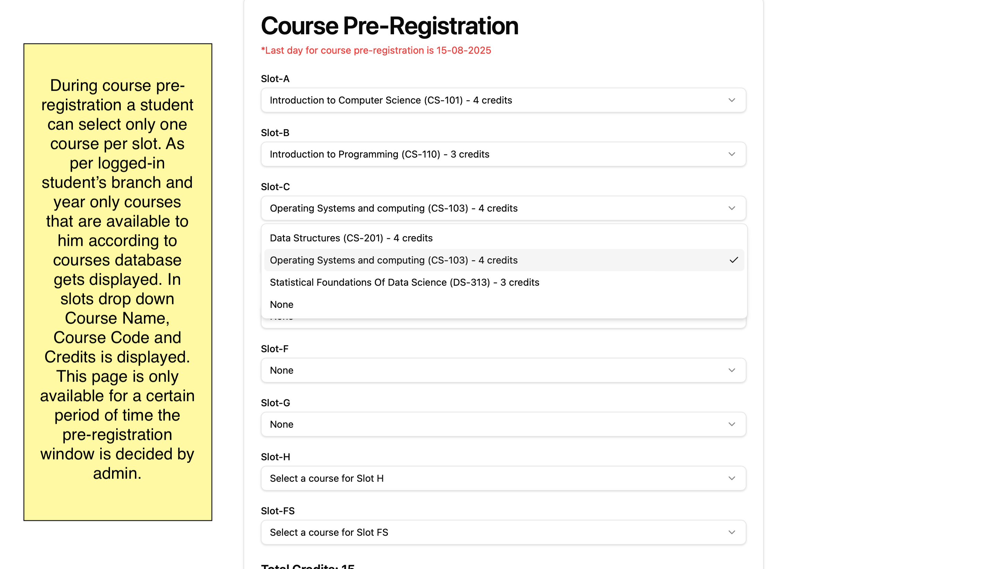  
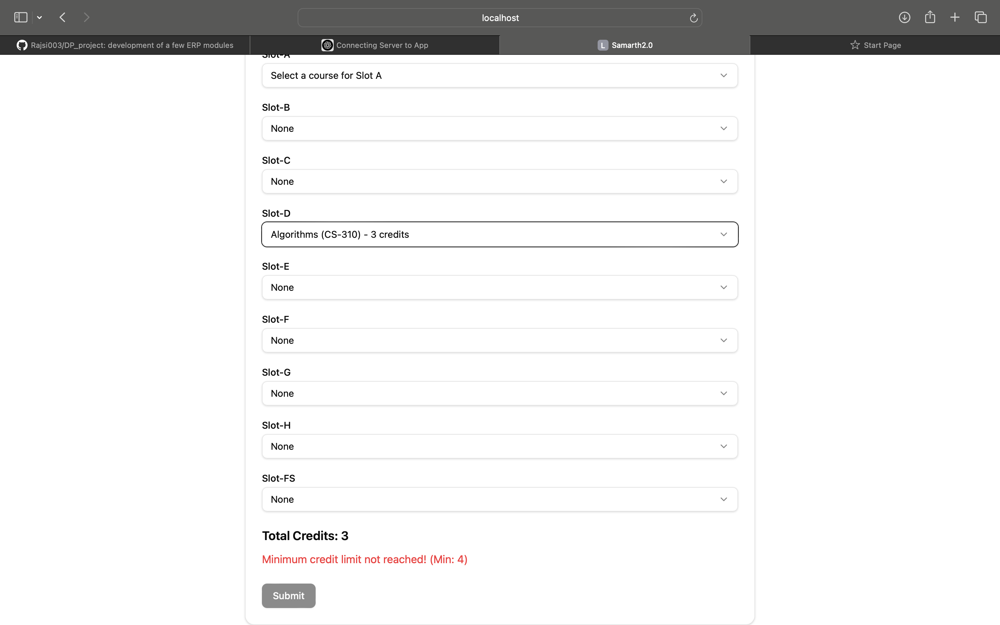  
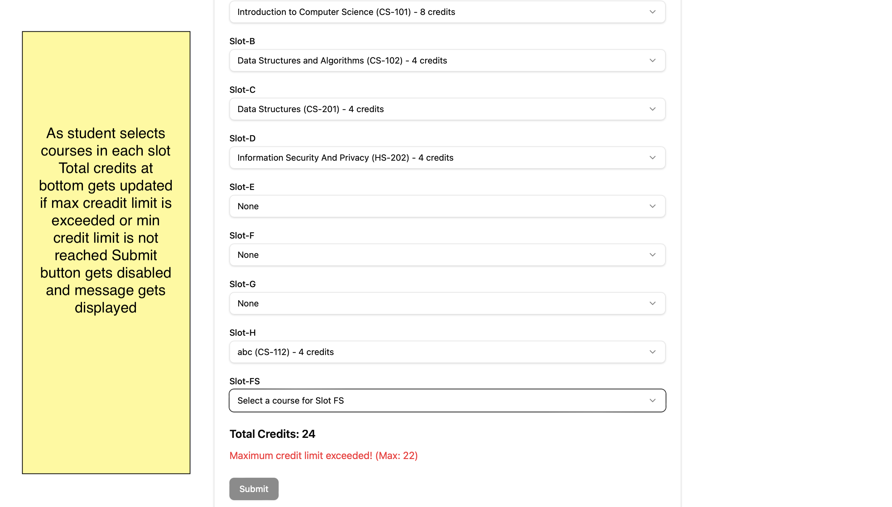

### 📄 Course Summary
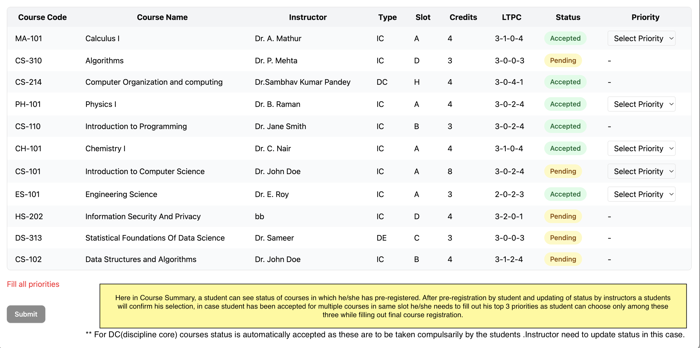  
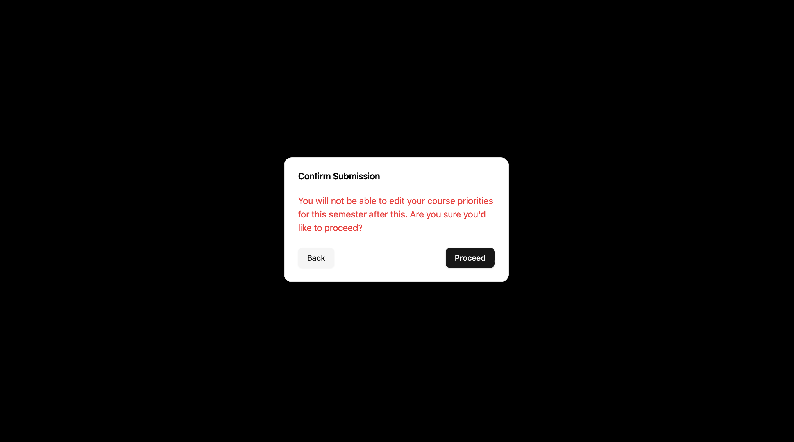

### 🧾 Course Registration
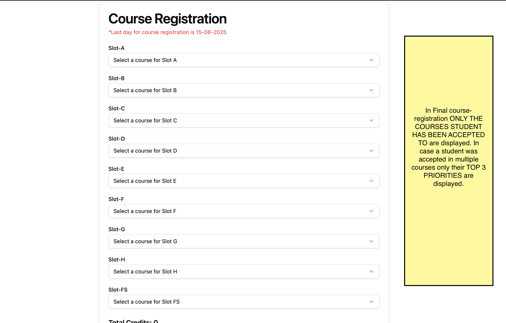  
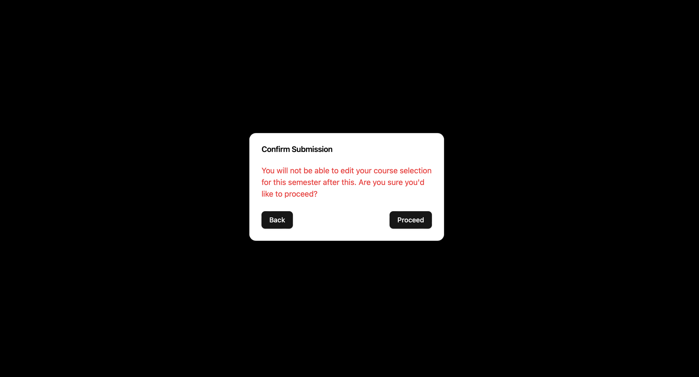

### 👩‍💼 Admin Login
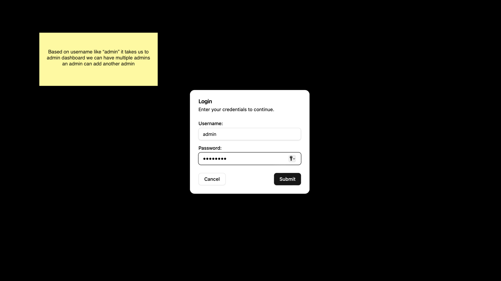

### 🛠️ Admin Dashboard
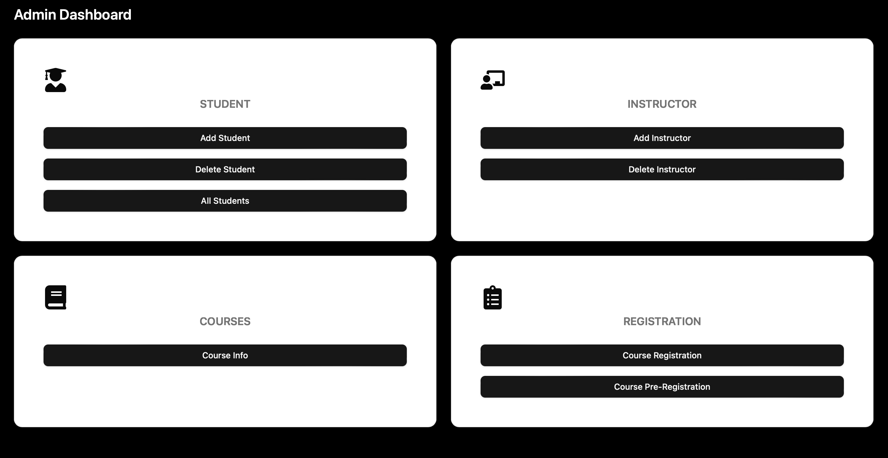

### 📋 Course Details
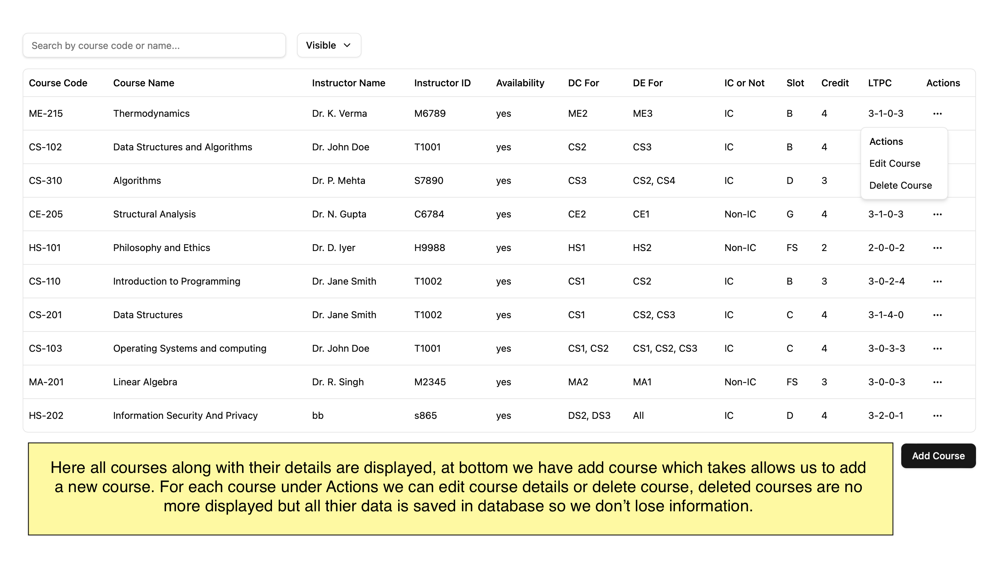  
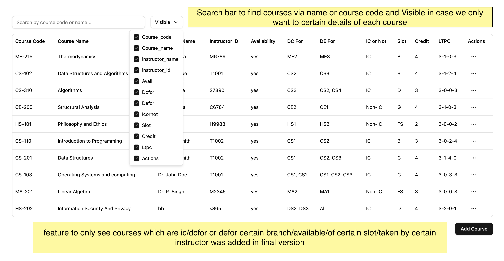

### ✏️ Edit Course Details
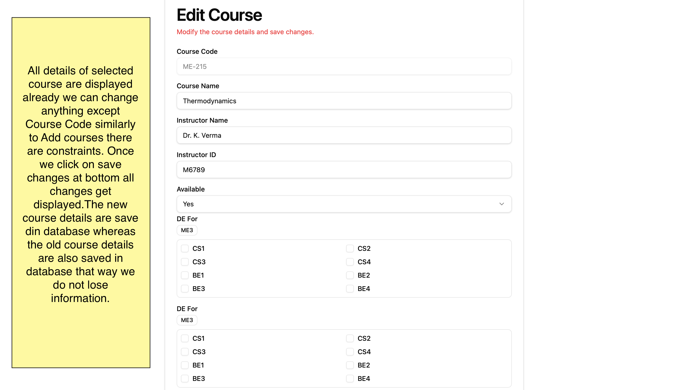

### ➕ Add New Course
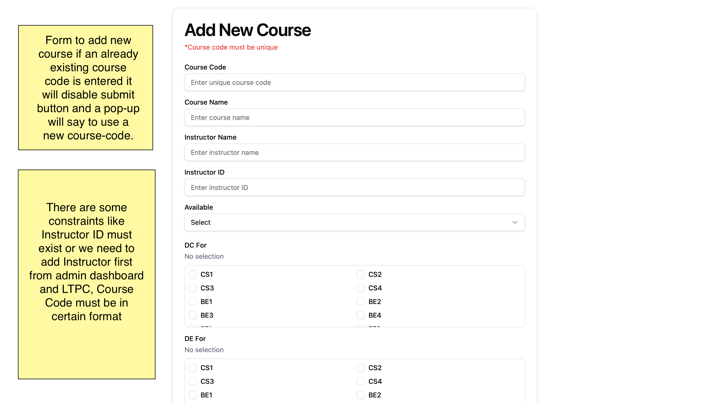

### 👨‍🏫 Instructor Login
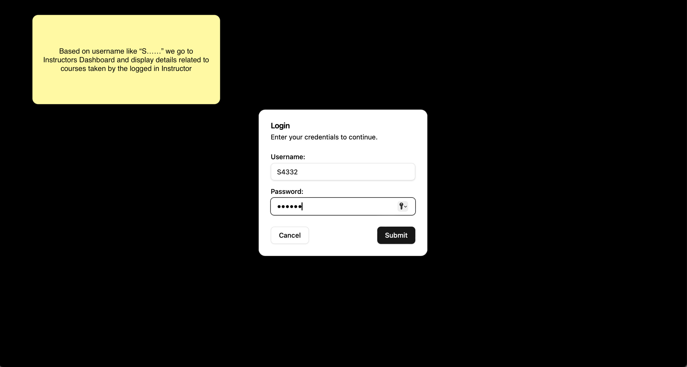

### 📊 Instructor Dashboard
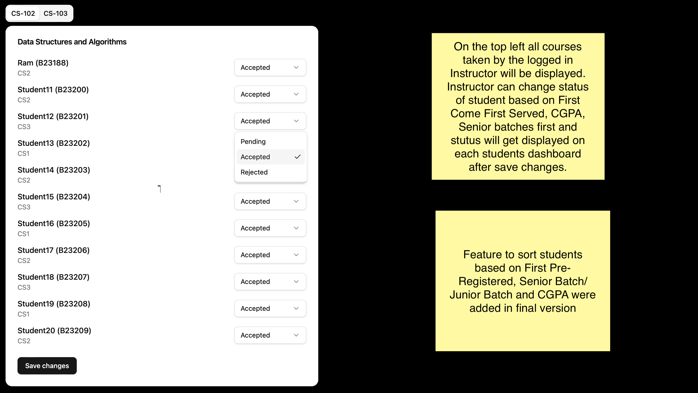


